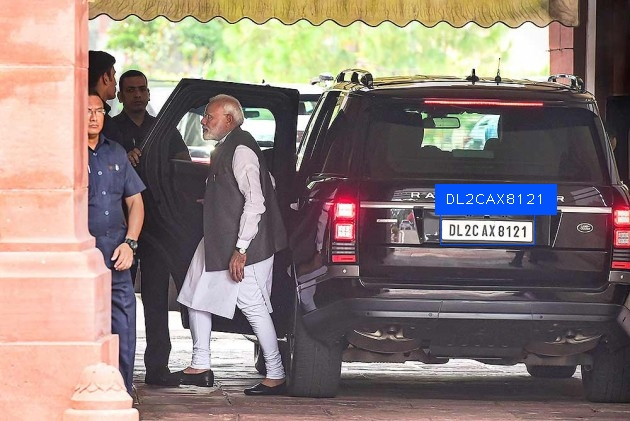

# Automatic Number Plate Recognition (ANPR) 🚗

Introducing my latest project, an Automatic Number Plate Recognition (ANPR) system powered by `YOLOv8` and `EasyOCR`, boasting an outstanding Mean Average Precision (mAP) of over `96%`. Leveraging the capabilities of YOLOv8 for robust object detection and EasyOCR for accurate text recognition, this project represents a significant achievement in my exploration of computer vision and machine learning. With a focus on efficiently detecting and extracting license plate information from images, this endeavor showcases my dedication to pushing the boundaries of technology while delivering practical solutions. As a culmination of extensive research and experimentation, this ANPR system underscores my commitment to excellence in developing cutting-edge data science solutions with real-world applications.
    
You can find some test [Images](/Images) and [Videos](/Videos) in the repository itself.

All the results will be stored in [Detections](./Detections) automatically.

To execute the streamlit application -
```
python -m streamlit run number_plate_detect.py
```


## 🚀 About Me
👋 Hi there! I'm **Mainak Mukherjee**, a passionate and ambitious B.Tech student with a strong drive to become a Data Scientist and Data Analyst. Welcome to my data-driven journey!


## Python Libraries used

- numpy
- ultralytics
- easyocr
- matplotlib
- seaborn
- tensorflow
- streamlit
- moviepy
- os
- cv2
- cvzone
- shutil


## Link for the dataset and Kaggle Notebook

[Roboflow](https://universe.roboflow.com/augmented-startups/vehicle-registration-plates-trudk/browse?queryText=&pageSize=50&startingIndex=0&browseQuery=true)


## Author

- [@Mainakcris7](https://github.com/Mainakcris7)

## Feedback

If you have any feedback, please reach out to me at mainakcr72002@gmail.com